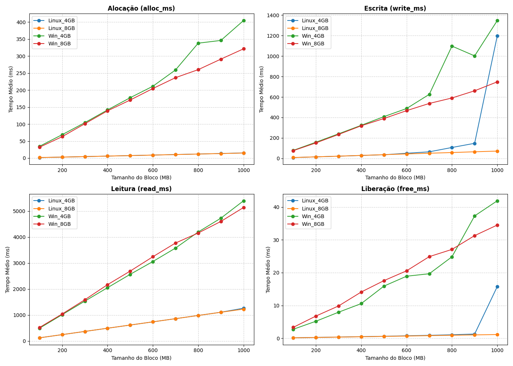

# Benchmark de Desempenho de Memória: Linux vs Windows

Este repositório contém os dados e a análise comparativa do desempenho de gestão de memória RAM entre os sistemas operativos **Linux** e **Windows**, avaliando instâncias com **4 GB** e **8 GB** de memória.

## 📊 O que é testado?

O benchmark mede o tempo de execução (em milissegundos) para quatro operações principais em blocos de memória de **100 MB a 1000 MB**:
1. **`alloc_ms`**: Tempo de alocação de memória.
2. **`write_ms`**: Tempo de escrita/preenchimento dos dados.
3. **`read_ms`**: Tempo de leitura e processamento dos dados.
4. **`free_ms`**: Tempo de libertação/desalocação de memória.

---

## 📈 Principais Resultados

- **Hardware utilizado:** Os testes foram feitos em um Macbook Pro M5, com máquinas virtuais (VM's) Windows e Linux, com arquitetura ARM. Para fins de comparação fora utilizados os mesmos parâmetros para ambas as máquinas virtuais.
- **Velocidade Geral:** O **Linux** foi aproximadamente **4 vezes mais rápido** que o Windows no tempo total de execução.
- **Alocação Instantânea:** O Linux tirou partido de *Lazy Allocation* / *Overcommit*, efetuando alocações em **< 16 ms**, enquanto o Windows variou entre **30 ms e 400 ms**.
- **Impacto do Swap (4 GB vs 8 GB):** No **Linux (4 GB)**, ao atingir blocos de 1000 MB, ocorreu um pico no tempo de escrita (**1199 ms**) devido ao uso de memória *swap*. Este gargalo não ocorreu no ambiente com **8 GB de RAM** (**71 ms**).

---

## 📁 Estrutura dos Ficheiros

- `Linux_4gb_results.csv`: Dados brutos do teste no Linux com 4 GB RAM.
- `Linux_8gb_results.csv`: Dados brutos do teste no Linux com 8 GB RAM.
- `Windows_4gb_results.csv`: Dados brutos do teste no Windows com 4 GB RAM.
- `Windows_8gb_results.csv`: Dados brutos do teste no Windows com 8 GB RAM.
- `benchmark_comparison.png`: Gráficos comparativos de desempenho das operações.